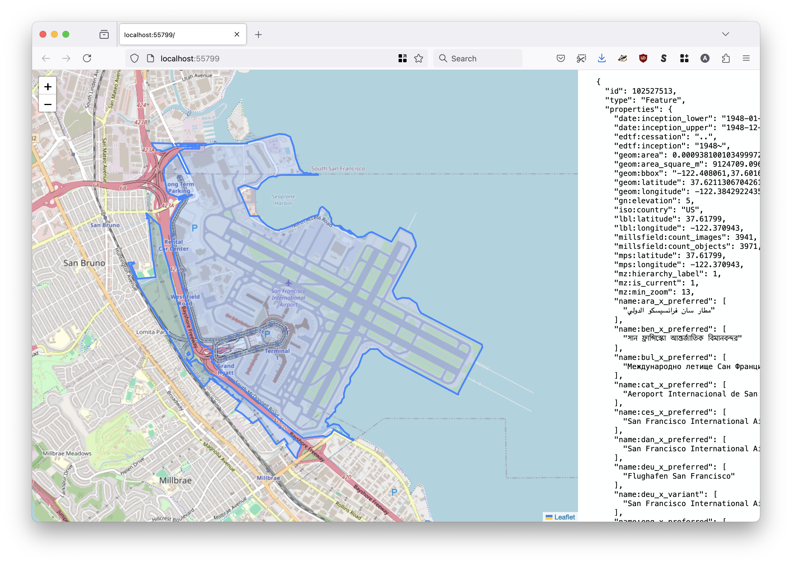
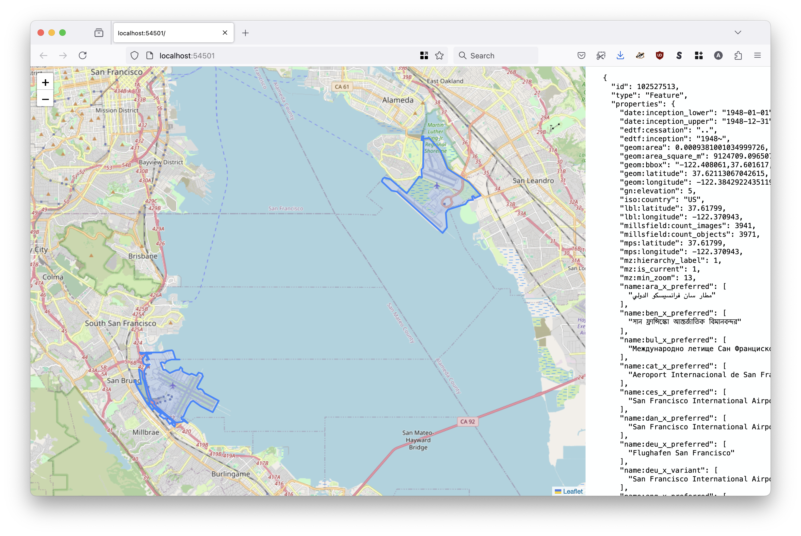
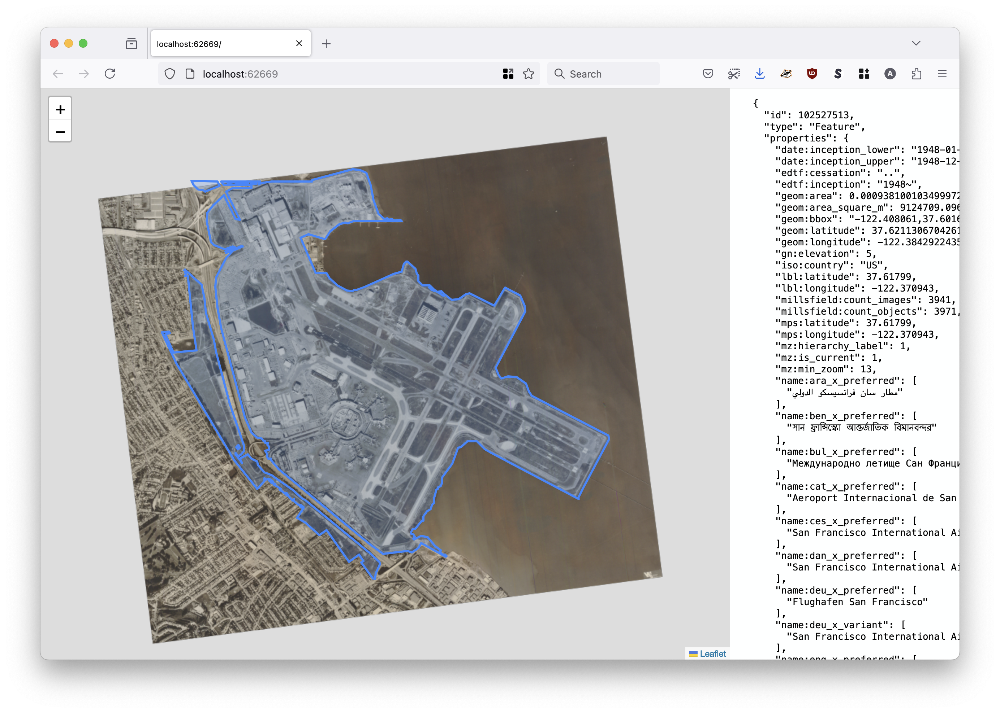
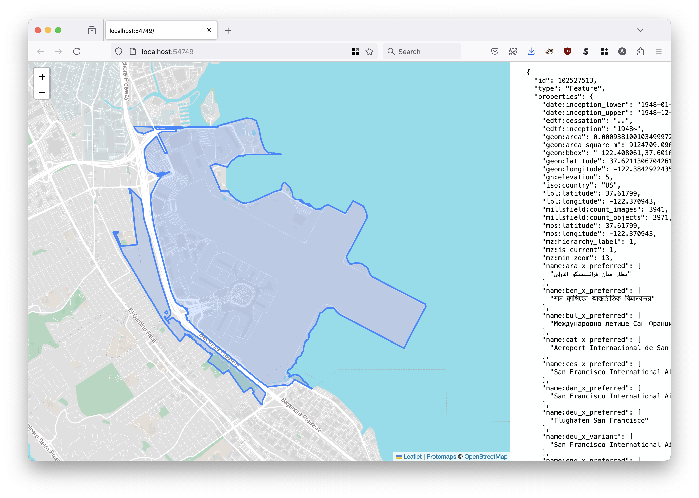
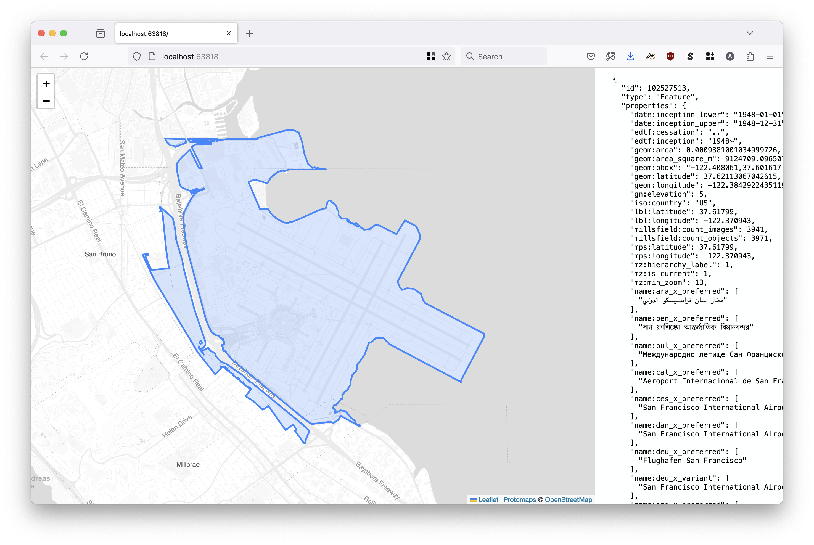
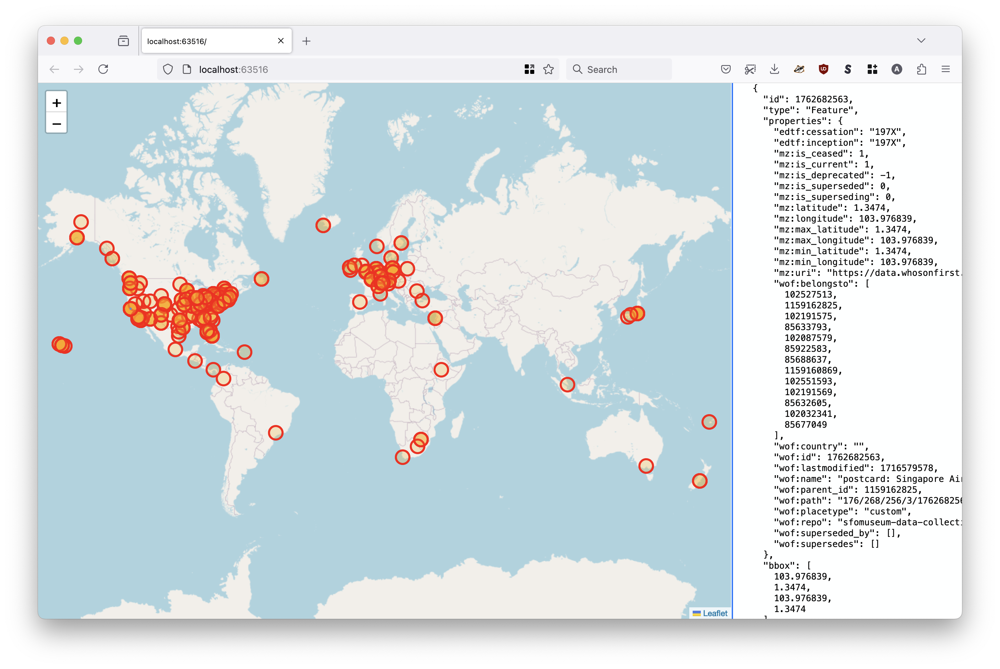
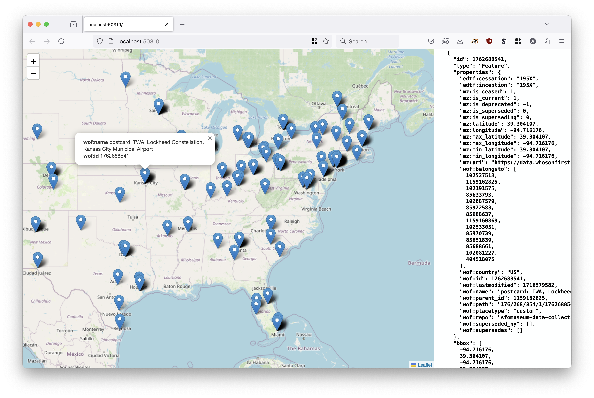

# go-geojson-show

Command-line tool for serving GeoJSON features from an on-demand web server.

## Motivation

It's basically a simpler and dumber version of [geojson.io](https://geojson.io/) that you can run locally from a single binary application. Also, the option for custom, local and private tile data.

## Documentation

Documentation (`godoc`) is incomplete at this time.

## Tools

```
$> make cli
go build -mod vendor -ldflags="-s -w" -o bin/show cmd/show/main.go
```

### show

```
$> ./bin/show -h
Command-line tool for serving GeoJSON features from an on-demand web server.
Usage:
	 ./bin/show path(N) path(N)
Valid options are:
  -label value
    	Zero or more (GeoJSON Feature) properties to use to construct a label for a feature's popup menu when it is clicked on.
  -map-provider string
    	Valid options are: leaflet, protomaps (default "leaflet")
  -map-tile-uri string
    	A valid Leaflet tile layer URI. See documentation for special-case (interpolated tile) URIs. (default "https://tile.openstreetmap.org/{z}/{x}/{y}.png")
  -point-style string
    	A custom Leaflet style definition for point geometries. This may either be a JSON-encoded string or a path on disk.
  -port int
    	The port number to listen for requests on (on localhost). If 0 then a random port number will be chosen.
  -protomaps-theme string
    	A valid Protomaps theme label. (default "white")
  -style string
    	A custom Leaflet style definition for geometries. This may either be a JSON-encoded string or a path on disk.

If the only path as input is "-" then data will be read from STDIN.
```

#### Examples

##### Read a single GeoJSON file from disk and show it on a map using the default settings (OpenStreetMap)



```
$> ./bin/show \
	/usr/local/data/sfomuseum-data-architecture/data/102/527/513/102527513.geojson
	
2024/08/13 13:01:44 Features are viewable at http://localhost:55799
```

##### Read multiple GeoJSON files from disk and show them on a map using the default settings (OpenStreetMap)




```
$> ./bin/show \
	/usr/local/data/sfomuseum-data-architecture/data/102/527/513/102527513.geojson \
	/usr/local/data/oak.geojson
	
2024/08/13 13:08:44 Features are viewable at http://localhost:54501
```

##### Read a single GeoJSON file from disk and show it on a map using custom tiles:



```
$> ./bin/show \
	-map-tile-uri 'https://static.sfomuseum.org/aerial/1978/{z}/{x}/{-y}.png'
	/usr/local/data/sfomuseum-data-architecture/data/102/527/513/102527513.geojson
	
2024/08/13 13:03:17 Features are viewable at http://localhost:62669
```

##### Read the (GeoJSON) output of another process and show those features on a map using a local [Protomaps](https://protomaps.com) database file and a named Protomaps theme



```
$> cat /usr/local/data/sfomuseum-data-architecture/data/102/527/513/102527513.geojson | \
	./bin/show \
	-map-provider protomaps \
	-map-tile-uri file:///usr/local/sfomuseum/go-http-protomaps/cmd/example/sfo.pmtiles \
	-protomaps-theme light \
	-
	
2024/08/13 13:05:13 Features are viewable at http://localhost:54749
```

##### Read the (GeoJSON) output of another process and show those features on a map using the Protomaps API



```
$> cat /usr/local/data/sfomuseum-data-architecture/data/102/527/513/102527513.geojson | \
	./bin/show \
	-map-provider protomaps \
	-map-tile-uri api://{APIKEY} \
	-
	
2024/08/13 13:07:08 Features are viewable at http://localhost:63818
```

##### Read a single GeoJSON file from disk and show it with a custom marker style



```
$> ./bin/show \
	-point-style '{"radius": 10, "color": "red", "fillColor": "orange" }' \
	/usr/local/data/postcards.geojson
	
2024/08/15 16:15:37 Features are viewable at http://localhost:63516
```

See [styles.go](styles.go) for details about the structure of the `LeafletStyle` struct used to encode custom map styles.

##### Read a single GeoJSON file from disk and show it with custom labels when a marker is clicked



```
$> ./bin/show \
	-label wof:name \
	-label wof:id \
	/usr/local/data/postcards.geojson
	
2024/08/15 16:12:39 Features are viewable at http://localhost:50310
```

When a marker is clicked the application will scroll that feature's string representation (in the right-hand pane) in to view and highlight its text.