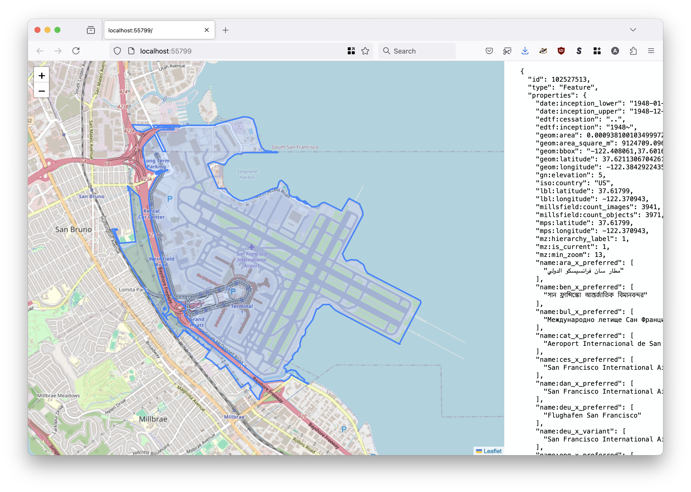
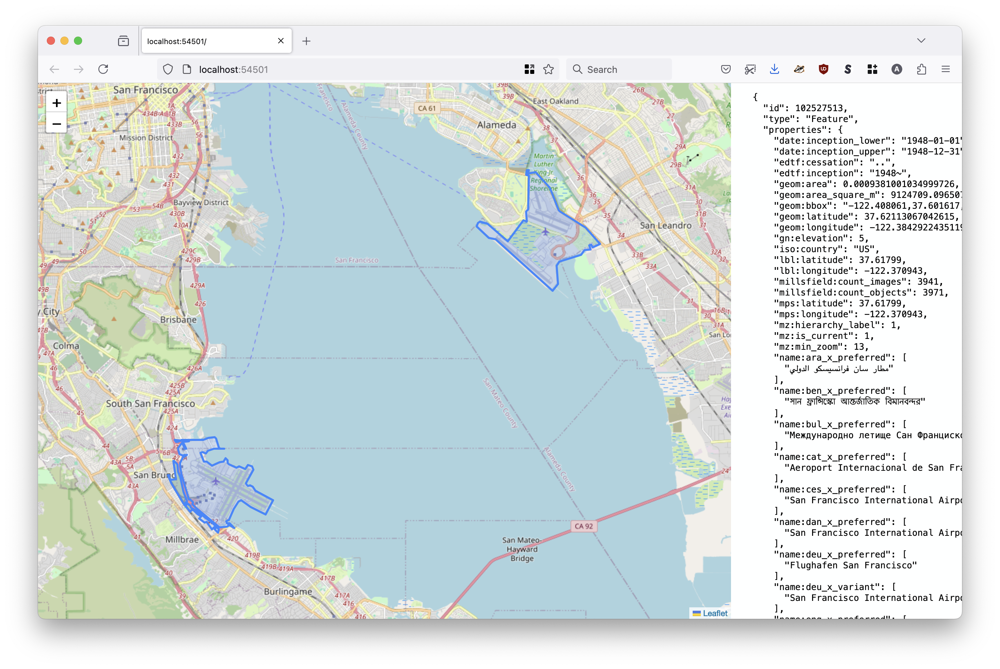
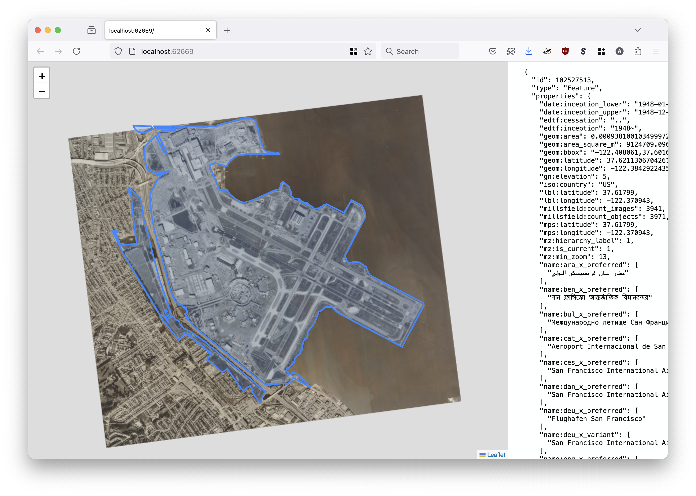
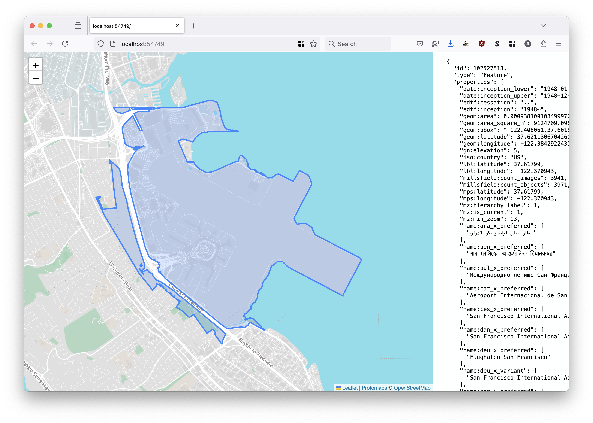
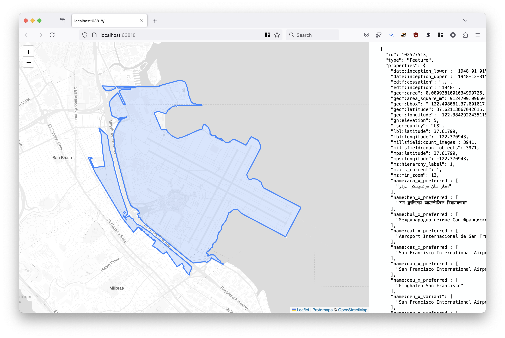
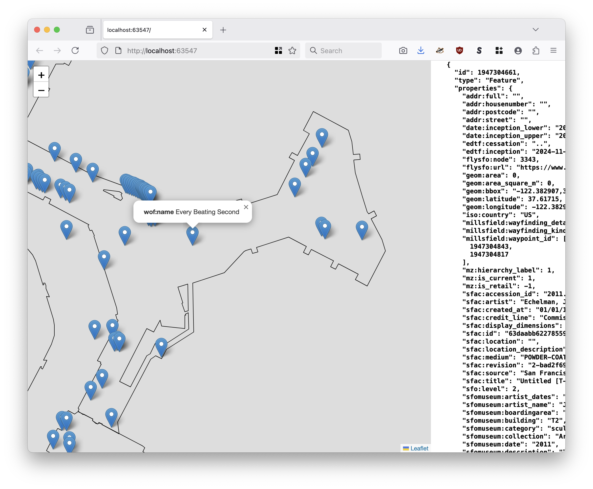
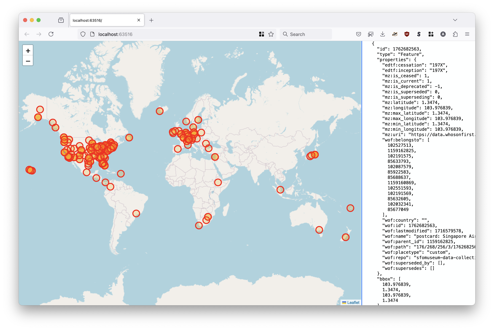
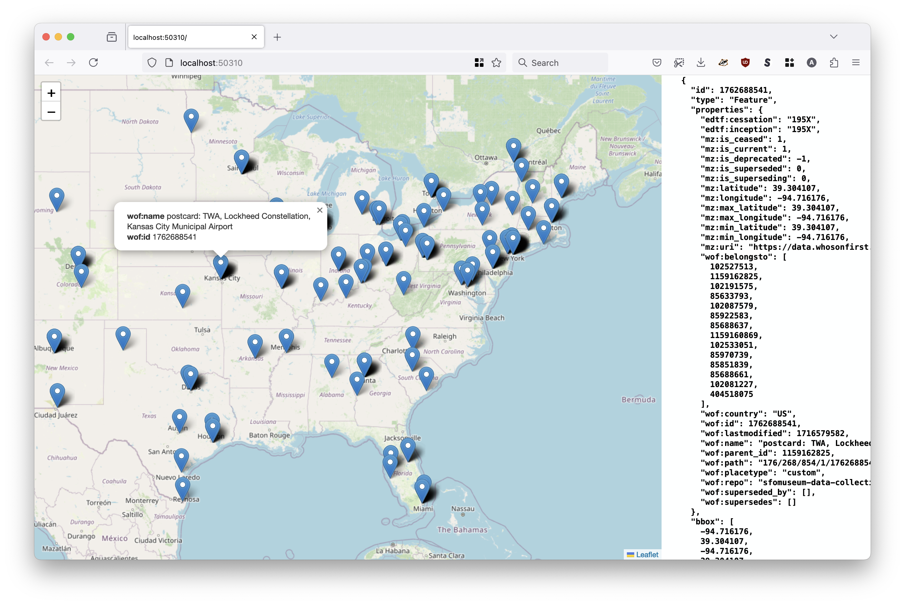
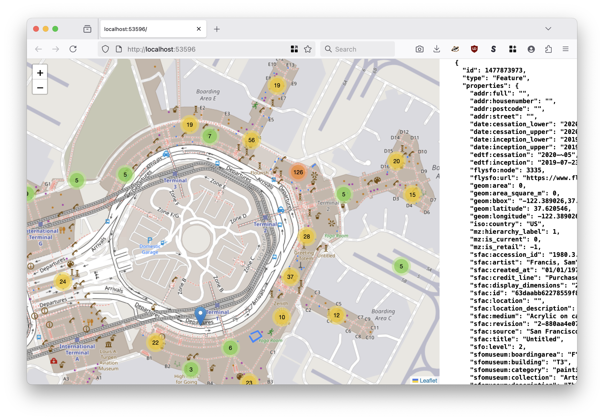
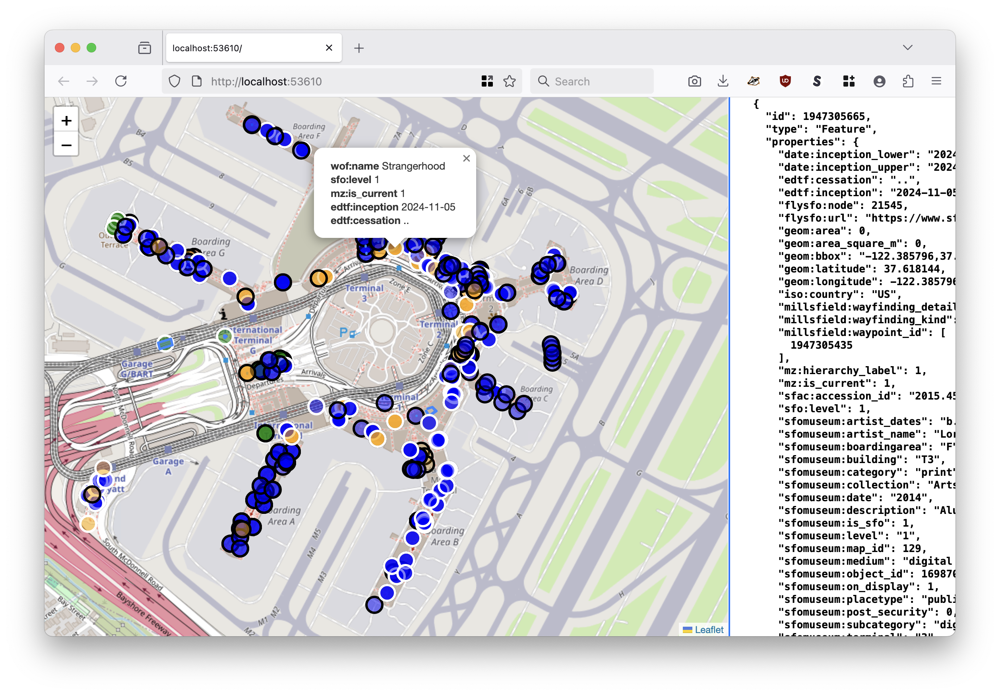

# go-geojson-show

Command-line tool for serving GeoJSON features from an on-demand web server.

## Motivation

It's basically a simpler and dumber version of [geojson.io](https://geojson.io/) that you can run locally from a single binary application. Also, the option for custom, local and private tile data.

Have a look at the [Small focused tools for visualizing geographic data](https://millsfield.sfomuseum.org/blog/2024/10/02/show/) blog post for more background.

## Documentation

Documentation (`godoc`) is incomplete at this time.

## Tools

```
$> make cli
go build -mod vendor -ldflags="-s -w" -o bin/show cmd/show/main.go
```

To enable use the [WebViewBrowser `Browser` implementation](https://github.com/sfomuseum/go-www-show?tab=readme-ov-file#webviewbrowser-webview) tools will need to be build with the `webview` tag set. For example:

```
$> go build -mod vendor -ldflags="-s -w" -tags webview -o bin/show cmd/show/main.go
```

### show

```
$> ./bin/show -h
Command-line tool for serving GeoJSON features from an on-demand web server.
Usage:
	 ./bin/show path(N) path(N)
Valid options are:
  -browser-uri string
    	A valid sfomuseum/go-www-show/v2.Browser URI. Valid options are: web:// (default "web://")
  -cluster-markers
    	Cluster markers that a proximate to one another.
  -esri-feature-layer value
    	One or more ESRI Feature layer URIs to use as a base map. Required if -map-provider is 'esri'.
  -label value
    	Zero or more (GeoJSON Feature) properties to use to construct a label for a feature's popup menu when it is clicked on.
  -map-provider string
    	Valid options are: leaflet, protomaps, esri. (default "leaflet")
  -map-tile-uri string
    	A valid Leaflet tile layer URI. See documentation for special-case (interpolated tile) URIs. (default "https://tile.openstreetmap.org/{z}/{x}/{y}.png")
  -pane value
    	Zero or more {LABEL}={Z_INDEX} pairs used to define Leaflet pane information.
  -point-style string
    	A custom Leaflet style definition for point geometries. This may either be a JSON-encoded string or a path on disk.
  -port int
    	The port number to listen for requests on (on localhost). If 0 then a random port number will be chosen.
  -protomaps-max-data-zoom int
    	The maximum zoom (tile) level for data in a PMTiles database. Necessary for "over-zooming".
  -protomaps-theme string
    	A valid Protomaps theme label. (default "white")
  -style string
    	A custom Leaflet style definition for geometries. This may either be a JSON-encoded string or a path on disk.
  -verbose
    	Enable verbose (debug) logging.

If the only path as input is "-" then data will be read from STDIN.
```

#### Examples

##### Read a single GeoJSON file from disk and show it on a map using the default settings (OpenStreetMap)



```
$> ./bin/show \
	/usr/local/data/sfomuseum-data-architecture/data/102/527/513/102527513.geojson
	
2024/08/13 13:01:44 Features are viewable at http://localhost:55799
```

##### Read multiple GeoJSON files from disk and show them on a map using the default settings (OpenStreetMap)




```
$> ./bin/show \
	/usr/local/data/sfomuseum-data-architecture/data/102/527/513/102527513.geojson \
	/usr/local/data/oak.geojson
	
2024/08/13 13:08:44 Features are viewable at http://localhost:54501
```

##### Read a single GeoJSON file from disk and show it on a map using custom tiles:



```
$> ./bin/show \
	-map-tile-uri 'https://static.sfomuseum.org/aerial/1978/{z}/{x}/{-y}.png'
	/usr/local/data/sfomuseum-data-architecture/data/102/527/513/102527513.geojson
	
2024/08/13 13:03:17 Features are viewable at http://localhost:62669
```

##### Read the (GeoJSON) output of another process and show those features on a map using a local [Protomaps](https://protomaps.com) database file and a named Protomaps theme



```
$> cat /usr/local/data/sfomuseum-data-architecture/data/102/527/513/102527513.geojson | \
	./bin/show \
	-map-provider protomaps \
	-map-tile-uri file:///usr/local/sfomuseum/go-http-protomaps/cmd/example/sfo.pmtiles \
	-protomaps-theme light \
	-
	
2024/08/13 13:05:13 Features are viewable at http://localhost:54749
```

##### Read the (GeoJSON) output of another process and show those features on a map using the Protomaps API



```
$> cat /usr/local/data/sfomuseum-data-architecture/data/102/527/513/102527513.geojson | \
	./bin/show \
	-map-provider protomaps \
	-map-tile-uri api://{APIKEY} \
	-
	
2024/08/13 13:07:08 Features are viewable at http://localhost:63818
```

##### Read the (GeoJSON) output of another process and show those features on a map using an ESRI Feature layer endpoint



```
$> ./bin/show \
	-map-provider esri \
	-esri-feature-layer https://{HOST}/arcgis/rest/services/{SERVICE}/MapServer/{LAYER} \
	-label wof:name \
	/usr/local/data/sfomuseum-data-publicart/work/publicart-latest.geojson
	
2025/11/04 10:34:48 INFO Server is ready and features are viewable url=http://localhost:63547
```

As of this writing ESRI feature layers have limited styling options. The default styling is simply to draw each feature with a simple black border and fill. You can override the default Leaflet style options (`color`, `opacity`, `fillColor` and `fillOpacity`) by passing them in as query parameters to the feature layer prepended by a "_". For example:

```
https://{HOST}/arcgis/rest/services/{SERVICE}/MapServer/{LAYER}?_fillColor=red&_fillOpacity=.5
```

_These query parameters will be removed from the URI before the feature layer is created._

You can specify multiple ESRI feature layers and they will be displayed in the order of their corresponding `-esri-feature-layer` flags.

##### Read a single GeoJSON file from disk and show it with a custom marker style



```
$> ./bin/show \
	-point-style '{"radius": 10, "color": "red", "fillColor": "orange" }' \
	/usr/local/data/postcards.geojson
	
2024/08/15 16:15:37 Features are viewable at http://localhost:63516
```

See [styles.go](styles.go) for details about the structure of the `LeafletStyle` struct used to encode custom map styles.

##### Read a single GeoJSON file from disk and show it with custom labels when a marker is clicked



```
$> ./bin/show \
	-label wof:name \
	-label wof:id \
	/usr/local/data/postcards.geojson
	
2024/08/15 16:12:39 Features are viewable at http://localhost:50310
```

When a marker is clicked the application will scroll that feature's string representation (in the right-hand pane) in to view and highlight its text.

##### Read a single GeoJSON file from disk and cluster the markers



```
$> ./bin/show \
	-cluster-markers \
	/usr/local/data/sfomuseum-data-publicart/work/publicart-all.geojson | 

2025/10/30 15:46:37 INFO Server is ready and features are viewable url=http://localhost:53596
```

##### Read a single GeoJSON file from disk and apply per-property styles



```
$> ./bin/show \
	-label wof:name \
	-label sfo:level \
	-label mz:is_current \
	-label edtf:inception \
	-label edtf:cessation \
	-pane is_current=1000 \
	-pane not_current=500 \
	-point-style styles.json \	
	/usr/local/data/sfomuseum-data-publicart/work/publicart-all.geojson

2025/10/30 15:50:01 INFO Server is ready and features are viewable url=http://localhost:53610
```

Aside from the `-label` flags (described above) this example exposes two other flags:

* `-pane` which is used to define Leaflet map panes where GeoJSON features should be created.
* `-point-style` which was discussed above but references a file with _custom_ style/layer configuration details that will be applied based on the presence and values of specific properties for each feature. These values will override any default style properties. For example:

```
{
    "radius": 10,
    "color": "red",
    "fillColor": "orange",
    "custom": {
	"pane_map": {
	    "property": "mz:is_current",
	    "key": {
		"1": "is_current",
		"*": "not_current"
	    }
	},
	"fill_map": {
	    "property": "sfo:level",
	    "key": {
		"1": { "color": "orange", "opacity": 0.5 },
		"2": { "color": "blue", "opacity": 0.5 },
		"3": { "color": "green", "opacity": 0.5 } }
	},
	"color_map": {
	    "property": "mz:is_current",
	    "key": {
		"-1": { "color": "#ccc", "opacity": 1 },
		"1": { "color": "white", "opacity": 1 },
		"0": { "color": "#000", "opacity": 1 }
	    }
	}
    }
}
```


## Advanced usage

### Using `go-geojson-show` as a package

What follows is an annotated and abbreviated version of the code used by the [whosonfirst/wof-cli](https://github.com/whosonfirst/wof-cli/blob/main/show/show.go) package to show features on a map using the `sfomuseum/go-geojson-show` package.

_For the sake of brevity error handling has been omitted._

#### Step 1: Parsing flags and deriving default "run options":

The first step is to import any necessary packages including `github.com/sfomuseum/go-geojson-show` which is used to define a default flag set, parse command line arguments and then derive "run options" for the application.

```
import (
        "context"
	"io"
	"slices"

	"github.com/paulmach/orb/geojson"
	sfom_show "github.com/sfomuseum/go-geojson-show"
	"github.com/whosonfirst/wof"
	"github.com/whosonfirst/wof/reader"
	"github.com/whosonfirst/wof/uris"	
)

func show(args []string) {

	fs := sfom_show.DefaultFlagSet()
	fs.Parse(args)

	fs_uris := fs.Args()

	run_opts, _ := sfom_show.RunOptionsFromFlagSet(ctx, fs)
```

#### Step 2: Doing custom work to derive a list of `geojson.Feature` records to display

This is custom code, specific to the `wof-cli` package. It defines a set of default properties to use for marker labels and supplements them with any new labels passed defined in the flagset / run options. Afterwards it derives one or more GeoJSON feature records, using its own internal logic, from paths defined on the command line.

```
	label_props := []string{
		"wof:name",
		"wof:id",
		"wof:placetype",
		"src:geom",
	}

	for _, prop := range run_opts.LabelProperties {

		if !slices.Contains(label_props, prop) {
			label_props = append(label_props, prop)
		}
	}

	run_opts.LabelProperties = label_props

	fc := geojson.NewFeatureCollection()

	cb := func(ctx context.Context, uri string) error {

		r, is_stdin, _ := reader.ReadCloserFromURI(ctx, uri)

		if !is_stdin {
			defer r.Close()
		}

		body, _ := io.ReadAll(r)

		f, _ := geojson.UnmarshalFeature(body)

		fc.Append(f)
		return nil
	}

	uris.ExpandURIsWithCallback(ctx, cb, fs_uris...)
```

#### Step 3: Showing features on a map

Finally, the run options are updated with the new list of features and the `RunWithOptions` method is invoked.

```
	run_opts.Features = fc.Features
	return sfom_show.RunWithOptions(ctx, run_opts)
}
```

That's it.
